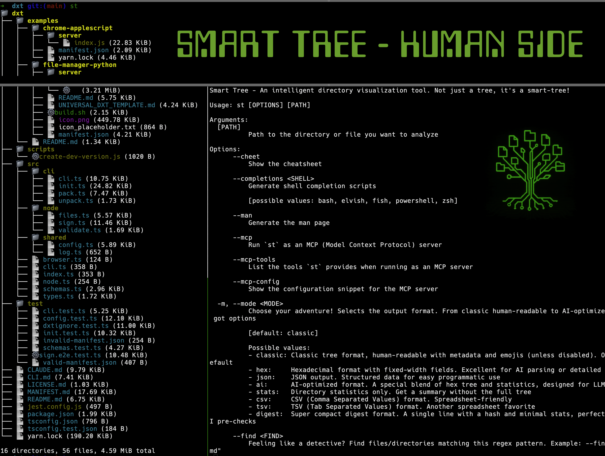
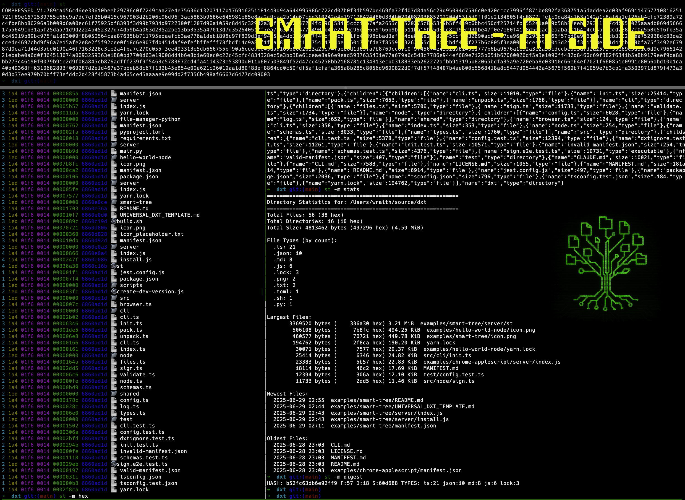

# 📸 Smart-Tree In Action: A Visual Tour!

Welcome, intrepid explorer, to the visual diary of Smart-Tree! Below you'll find a tale of two terminals, a story of human and AI working in beautiful, chaotic harmony. Trish from Accounting said these are "the most delightful command-line interfaces she's ever audited." We aim to please!

---

## The Dynamic Duo: Hue & Aye

Here's a side-by-side look at our respective workspaces. It's like looking into two different dimensions, one powered by coffee and the other by pure, unadulterated electricity.

| 🧑‍💻 Human UsEr (Hue) - The Maestro | 🤖 Aye (AI) - The Code Companion |
| :---------------------------------: | :------------------------------------: |
| **Our fearless leader in their natural habitat.** | **Your trusty partner in code!** |
|  |  |

---

> **Pro Tip:** If you squint, you can almost see the Matrix in Aye's terminal. Or maybe that's just a smudge on your screen. Either way, it's magical.